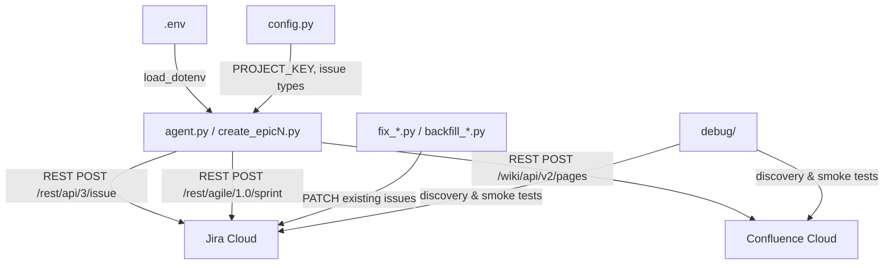

# vistara-pm-agent

> **Python agent that builds enterprise-grade Jira + Confluence portfolios via the Atlassian REST API and Anthropic Claude API.**


---

## Why this exists

Between 2022 and 2025 I served as Project Manager at **Vistara Animation**, leading real programme delivery across four strategic initiatives — curriculum brochures, festival logistics, college partnerships, and industry placement pipelines. The work happened in the field: spreadsheets, WhatsApp threads, physical whiteboards.

This agent retrospectively documents that body of work as a professional Jira + Confluence portfolio:

| Dimension | Count |
|---|---|
| Epics | 4 |
| Stories | 42 |
| Sub-tasks | 20+ |
| Sprints | 9 |
| Confluence pages | in progress |

Each script was written to solve a concrete API problem discovered while building the portfolio. The codebase is the artefact — it shows not just *what* was managed, but *how* the documentation was engineered.

**Portfolio PDF:** [Portfolio — link to be added]

---

## Architecture



---

## What each script does

| Script | Purpose |
|---|---|
| `agent.py` | Core helper — `create_issue()` function used across Epic 1 & 2; reads env vars, sets auth headers |
| `config.py` | Shared constants: `PROJECT_KEY = "VAI"`, issue type strings |
| `create_epic3.py` | Builds Epic 3 (Cinemotsava 2025): 14 stories, sub-tasks, acceptance criteria, Sprints 6–7 |
| `create_epic4.py` | Builds Epic 4 (Partner College & Placement Pipeline): 10 stories, sub-tasks, acceptance criteria, Sprints 8–9 |
| `create_sprints.py` | Creates Sprints 4–5 for the Epic 2 brochure workstream via Agile API |
| `assign_sprints.py` | Bulk-assigns issue keys to sprint IDs via `POST /rest/agile/1.0/sprint/{id}/issue` |
| `add_acceptancecriteria.py` | Posts acceptance criteria as ADF-formatted comments on all Epic 1 & 2 stories |
| `fix_storypoints.py` | Patches story points on Epic 2 stories using `customfield_10037` |
| `fix_subtasks.py` | Adds two missing sub-tasks to Epic 2 parent stories |
| `fix_subtasks_e3.py` | Adds three missing sub-tasks to Epic 3 parent stories |
| `backfill_epic1_points.py` | Retrospectively sets story points on all 10 Epic 1 issues |
| `find_sprints.py` | Discovery — lists all boards and sprints for the VAI project (used to get board ID 100) |
| `find_confluence.py` | Discovery — lists personal and global Confluence spaces to locate the VAI space |
| `debug/debug_addcriteria.py` | Verifies env vars load correctly and tests comment API against VAI-15 |
| `debug/debug_direct.py` | Hardcoded-credential smoke test to isolate auth failures from `.env` loading |
| `debug/debug_points.py` | Scans all Jira fields to identify story point custom field IDs |
| `debug/delete_testpage.py` | Deletes a specific Confluence test page by page ID |
| `debug/test_confluence_write.py` | Creates a test page in the VAI Confluence space to verify write permissions |
| `debug/test_personal_direct.py` | Attempts to access the personal Confluence space by its `~userid` key |
| `debug/test_personal_space.py` | Lists all Confluence spaces to locate the personal space key |

---

## Quick start

```bash
# 1. Clone
git clone https://github.com/divyagowdrudinesh/vistara-pm-agent.git
cd vistara-pm-agent

# 2. Install dependencies
pip install -r requirements.txt

# 3. Configure credentials
cp .env.example .env
# Open .env and fill in your Atlassian API token, email, base URL, and Anthropic key

# 4. Run the main agent
python agent.py
```

---

## Key technical decisions

### 1 — `customfield_10037` not `customfield_10016`
Jira Cloud uses two different custom field IDs for story points depending on whether the project uses next-gen or classic boards. `customfield_10016` is the next-gen field; `customfield_10037` is the classic Software board field. `debug_points.py` was written specifically to enumerate all field IDs and find the correct one.

### 2 — `"Sub-task"` (hyphenated)
The Jira REST API v3 rejects `"Subtask"` with a 400. The correct issue type name is `"Sub-task"` with a hyphen. This is not documented prominently in the official docs.

### 3 — Atlassian 404 on expired token
When an Atlassian API token expires, the platform returns **404** (not 401). This means expiry looks like a missing resource, not an authentication failure. Always check token validity first when you see unexpected 404s on known issue keys.

### 4 — ADF 5-level nesting for acceptance criteria
Confluence Atlassian Document Format requires a strict content hierarchy for structured content:
`doc → bulletList → listItem → paragraph → text`. Flattening or skipping any level causes a 400 with a cryptic schema validation error.

---

## Bug log

| # | Bug | Root cause | Fix |
|---|---|---|---|
| 1 | Story points not saving | Used `customfield_10016` (next-gen field) on a classic board | Switched to `customfield_10037` found via `debug_points.py` |
| 2 | Sub-task creation 400 | Issue type name `"Subtask"` rejected by API | Changed to `"Sub-task"` (hyphenated) per Jira schema |
| 3 | All requests returning 404 | Atlassian API token expired mid-session | Rotated token in `.env`; confirmed with `debug_direct.py` |
| 4 | Confluence page creation 400 | ADF content nesting was missing the `listItem` level | Added full 5-level hierarchy: doc → bulletList → listItem → paragraph → text |
| 5 | Sprint creation 400 | Sent `projectKey` instead of `originBoardId` | Changed payload to use `originBoardId: 100` (found via `find_sprints.py`) |
| 6 | Sprint assignment 404 | Used core REST API (`/api/3/`) for sprint operations | Switched to Agile API (`/agile/1.0/sprint/{id}/issue`) |
| 7 | Personal Confluence space not found | Queried v2 API which does not return personal spaces | Switched to v1 `?type=personal` query (found via `find_confluence.py`) |
| 8 | `load_dotenv()` silently failing | `.env` file not in working directory when running from IDE | Added explicit `load_dotenv()` call at top of every script; confirmed with `debug_addcriteria.py` |

---

## Author

**Divya G D** — Project Manager, Vistara Animation (2022–2025)

[LinkedIn](https://linkedin.com/in/divya-g-d-824b5b367)
